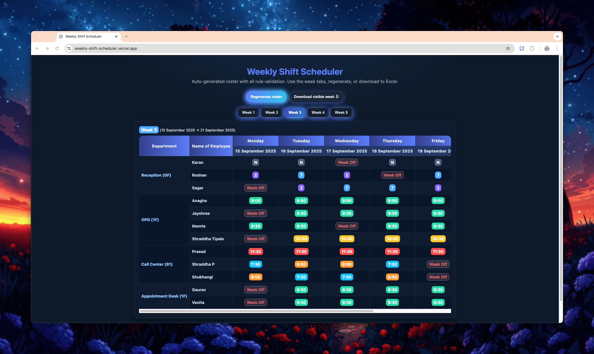

# 🗓️ Weekly Shift Scheduler

A beautiful, interactive **weekly roster generator** built with **HTML, CSS, and JavaScript**.  
It automatically assigns shifts with rules, allows **week-by-week navigation**, and supports **Excel export**.



---

## ✨ Features

- 🎲 **Auto-generate shifts** with random weekly swaps  
- 🗂️ **Tabbed weeks** (navigate easily)  
- 🎨 **Modern UI** with gradients, badges, and hover effects  
- 📥 **Download schedule to Excel** (`.xls` / `.xlsx`)  
- ⚡ **Lightweight** – pure vanilla JS (no heavy frameworks)  

---

## 🚀 Demo

👉 Live Demo: [GitHub Pages Link](https://yourusername.github.io/weekly-shift-scheduler)  

---

## 📂 Project Structure

```
📦 weekly-shift-scheduler
 ┣ 📜 index.html        # Main HTML
 ┣ 📜 logic.js          # Scheduling + Excel export
 ┣ 📜 styles.css        # Modern gradient styling
 ┣ 📂 docs/             # Assets like screenshots
 ┗ 📜 README.md
```

---

## 🛠️ Installation & Usage

1. Clone the repository:

```bash
git clone https://github.com/yourusername/weekly-shift-scheduler.git
cd weekly-shift-scheduler
```

2. Open `index.html` in your browser. That’s it ✅

---

## 📤 Export Options

- `Download visible week ⇩`  
Exports the currently visible week to Excel with styled formatting.  

Supports:  
- **HTML → .xls** export (preserves CSS look)  
- **SheetJS → .xlsx** export (native Excel, basic styling)

---

## 📸 Screenshots

### Main UI


### Excel Export


---

## 🧑‍💻 Contributing

Contributions are welcome!  
- Fork the repo  
- Create a feature branch  
- Submit a Pull Request 🎉

---

## 📜 License

This project is licensed under the **MIT License** – see the [LICENSE](LICENSE) file for details.
